## Table of contents
1. [Purpose](#Purpose)

2. [User Experience](#User-Experience)
 * [Target Audience](#target-audience)
 * [User Expectations](#User-expectations)
 * [User Stories](#user-stories)

3. [Structure and Design](#Structure-and-Design)
 * [Website Structure](#website-structure)
 * [Colour](#Colour)
 * [Fonts](#Fonts)
 * [Wireframes](#Wireframes)

 4. [Technology Used](Technology-Used)
 * [Languages](#languages)
 * [Tools and Frameworks](#tools-and-frameworks)

 5. [Features](#Features)
 * [Logo and navigation bar](#logo-and-navigation-bar)
 * [Footer](#footer)
 * [Home Page](#home-page)
 * [Showroom](#showroom)
 * [Contact](#contact)
 * [Form](#form)
 * [Map](#map)
 * [About](#about)
 * [Youtube video](#youtube-video)

 6. [Validation](#validation)
 * [HTML validation](#html-validation)
 * [CSS validation](#css-validation)

 7. [Performance](#performance)
 * [Performance testing using different devices](#performance-testing-using-different-devices/browsers)

 8. [Testing](#testing)
 * [Testing User Stories](#testing-user-stories)

 9. [Bugs](#bugs)

 10. [Deployment](#deployment)
 * [Creating this project](#creating-this-project)
 * [Github pages](#github-pages)
 * [To run locally](#to-run-locally)

 11. [Credits](#credits)
 * [Code](#code)
 * [media](#media)
 * [Acknowledgements](#acknowledgements)

 

# Purpose
I built this website as my second project for the code institutes full stack development and e-commerce applications course. 
I built this website from scratch using the knowledge I gained from the course where I studied the basics of HTML, CSS and Javascript. 

You can find a link to the live website [here](https://mcdaid101.github.io/Rock-Paper-Scissors-Lizard-Spock/).	

## Rock Paper Spock!

This website was built for fans of the Big Bang Theory and Star trek. This fun online game of rock, paper, scissors incorporates the Star Trek character Spock and a lizard into the mix, giving the game many more outcomes. Many people will know this version of the game from the television series The Big Bang Theory.
 

# User Experience

## Target Audience 
* Fans of the Big Bang theory
* Online gamers
* Fans of Star Trek
 

## User Expectations 
* Simple and easily navigated website
* Information on the game's rules that can be easily accessed
* Fully functioning links and features 
* Easily found Account sign up 
* Good design and presentation 
 

## User Stories
 

### As a first time user:
1. I want to be able to easily navigate the site.
2. I want to be able to play the game. 
3. I want to know what my score is in the game.
4. I want to know what my opponent's (the computer's) score is. 
5. I want to be able to view the website clearly on my mobile phone. 
6. I want to know the rules of the game. 
7. I want to know what button I chose.
8. I want to know what the computer picked in response.
9. I want to know the result of that round. 
10. I want to be able to easily navigate back to the home page.
 

### As a returning user:
1. I want to be able to sign up to know about future games produced by the creator. 
 

### As the site owner:
1. I want users to know how to play the game.
2. I want users to be able to sign up to our site to receive news on future games. 
3. I want users to be able to easily navigate the site. 
4. I want users to know who made this game.
 

# Structure and Design  
Each page on the site has the same header with the Rock Paper Spock logo on it, the home page has a sign up button which brings you to the about page and a pop up modal which explains how the game works. Below the buttons on the home page lies the Game area which has the game's option buttons which are fully interactive along with the result of the player's choice and the computer's choice and the outcome of who won. At the very bottom of the page is where the player and the computer's scores are incremented. In the about page below the home button is a form where players can sign up to create an account and get emailed about future games made by the creator. 
 

## Website Structure 
1. Home page containing buttons to the about page and rules modal and the game itself and a score area.
2. About page contains form to sign up and create an account.
3. 404 page. 
 

## Colour
The website was designed using a similar color #b3e6f4 to that of the star trek character Spock's iconic blue jumper, who is a feature of this game. The box shadow used on the home and about page containers also uses a box shadow effect which is also blue in color adding to the spock theme. 
 

## Fonts
The sole font family used is imported from the Google Fonts website and is called 'orbitron', this font has been used extensively throughout the website as it looks like a traditional computer game style font and suits the theme of the website. 
 

## Wireframes
* The wireframes designs are on a desktop, a tablet and a mobile phone. 

Home

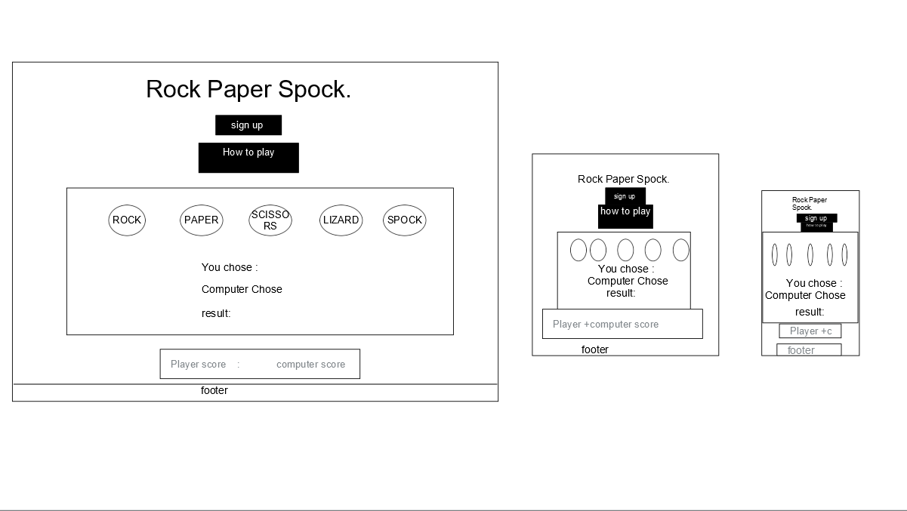

Sign up page

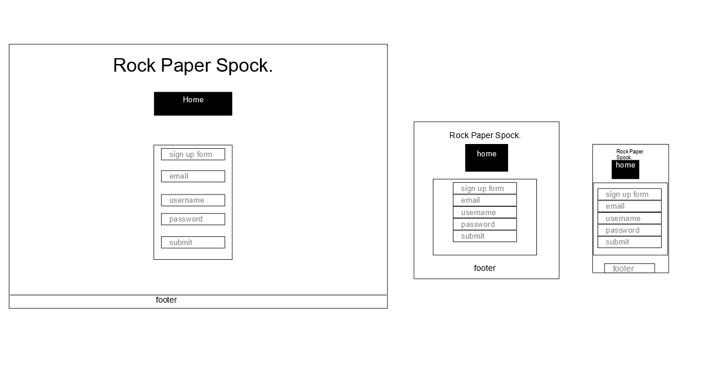

 

 

# Technology Used 
 

## Languages 
* HTML 
* CSS 
* Javascript
 

## Tools and Frameworks
* Git 
* Github 
* Google Fonts 
* Font Awesome
* GlassMorphism Generator from Glass Ui
* Vs Code IDE in browser
* Chrome developer tools 
* Techsini Multi Device Mockup Generator used in this readme to display an image of the website on different devices 
* html-css-js box shadow generator
* iconduck.com free online icons - source of site favicon and the game icons
* Freecodecamp - modal functions help
* Digitalfox tutorials - error messages in html form with javascript
* Bro Code - functions help

 

# Features
This website contains 2 webpages
 

Expand for Screenshots of each page and feature

## Logo and navigation bar 

* The logo is a feature on both pages.
* When clicked on it will bring you back to the home page.
 

## Footer

* The footer is also present on each page 
* The footer contains the name of Mc Daid games inc and the year the game was made. 
* It is fully responsive to different screen sizes 
 

* The Footer covers the user stories:      
* Site owner needs: 2. 

## Home page
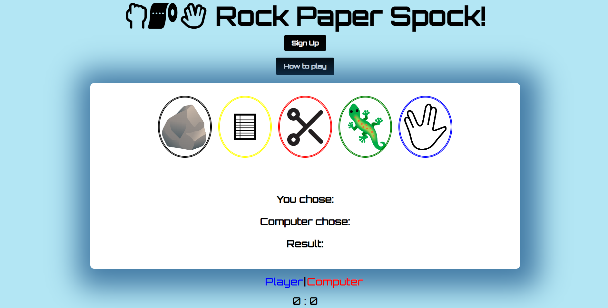
* This is the home page the first page users see
* Users have a link to the sign up page under the logo 
* Users have a modal they can open to learn the game rules and how it works 
* Users can use the buttons to play the game and can see what button they pressed and the computers choice too along with the result
* At the bottom of the page is the score area and the footer
 

* The Home page helps meet the first time user stories: 1, 2, 3, 4, 5, 6, 7, 8, 9.         
* Site owner needs: 1, 3, 4. 

## Game area 
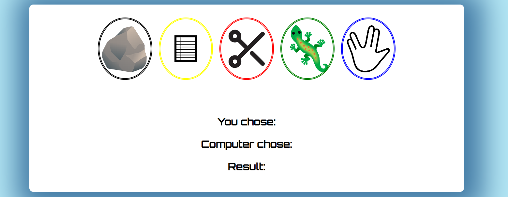
* The game area contains the game buttons, the users choice, the computers choice and the result.
 

* The Contact page helps meet the first time user stories: 2, 5, 7, 8.

## Score Area 

* The score area tells the user their score and the computers score. 
* The scores will stop incrementing once they hit 5 and the winner will be revealed by an alert which will refresh the game afterwards. 
 

* The score area helps meet the first time user stories: 3, 4, 5. 

## Modal rules pop up 
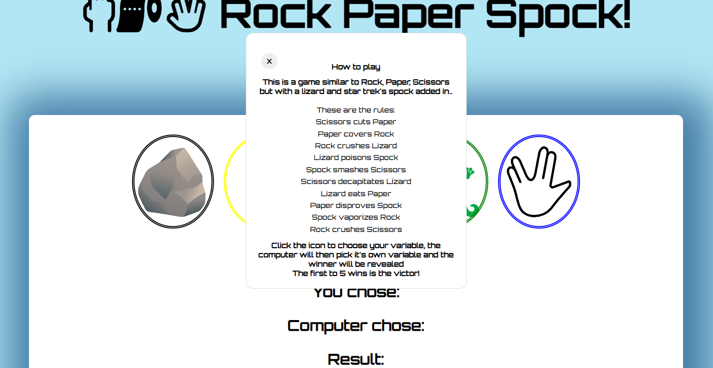
* When users click on the how to play button this popup will appear explaining how the game works.
* The user can click the X to to exit the popup.
 

* The rules pop up helps meet the first time user stories: 2, 6.   
* Site owner needs: 1. 

## You won alert 
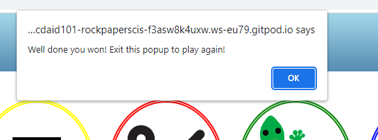
* When the player gets 5 wins they will receive an alert to let them know they have won and that the game will be restarted.
 

## You lost alert 
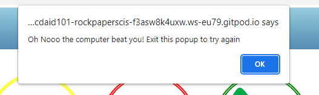
* When the computer gets 5 wins the player will receive an alert to let them know they have lost and the game will be restarted.
 

## Sign up page 
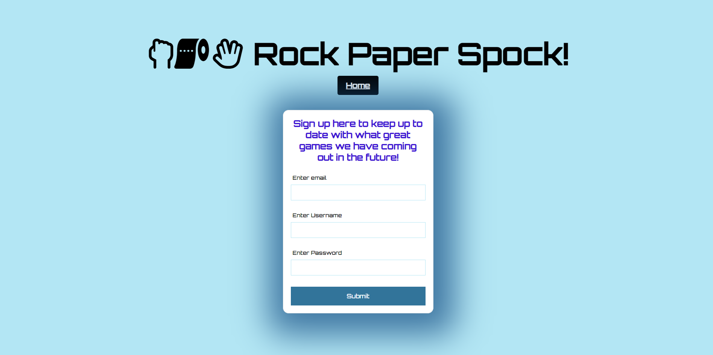
* The About page gives users the chance to sign up to receive news on future games by mcdaid games inc via the form on the page. 
* A button below the logo will redirect users to the home page.
* This page is fully responsive to any device screen 
 

* The sign up page helps meet the first time user stories: 5, 10.      
* As a returning user stories: 1.  
* Site owner needs: 2, 4. 

## Form
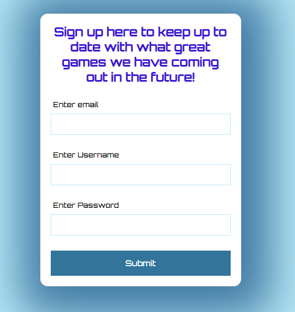
* This form lets users know that they need to fill out their email, username and password before continuing. 
 

* The Form helps meet the first time user stories: 5.      
* Returning user stories: 1.     
* Site owner needs: 2, 4. 

## 404 page

* 404 page if something goes wrong.

 

 

# Validation 
 

## HTML validation 
I tested the website with the W3C HTML Markup validation service and fixed anything that failed.

Index.html

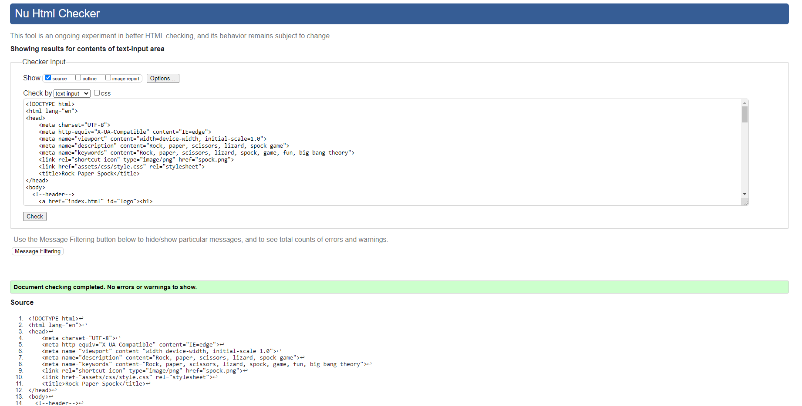

Sign up page

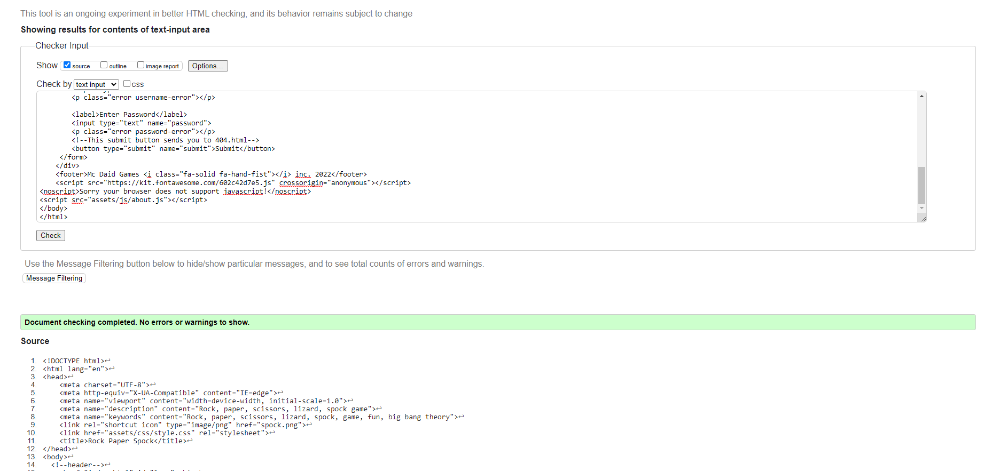

## CSS validation 
I tested the website with the W3C CSS Markup validation service and fixed anything that failed.

CSS validation Screenshot

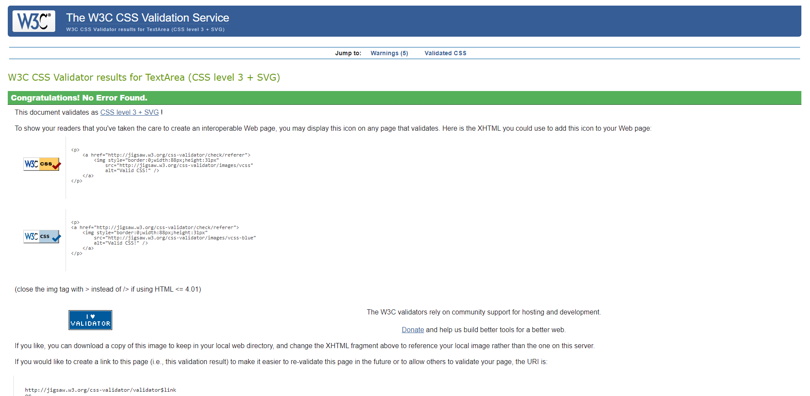

 

## Javascript validation 
I tested the website with the W3C CSS Markup validation service and fixed anything that failed.

Javascript validation Screenshot

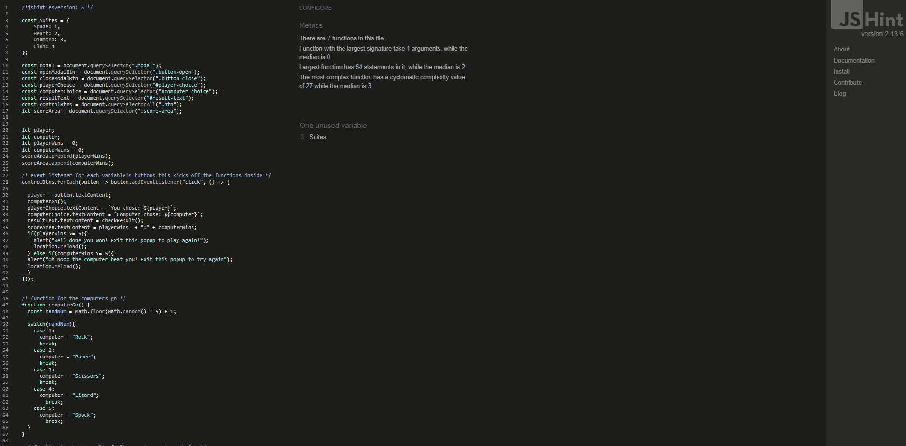
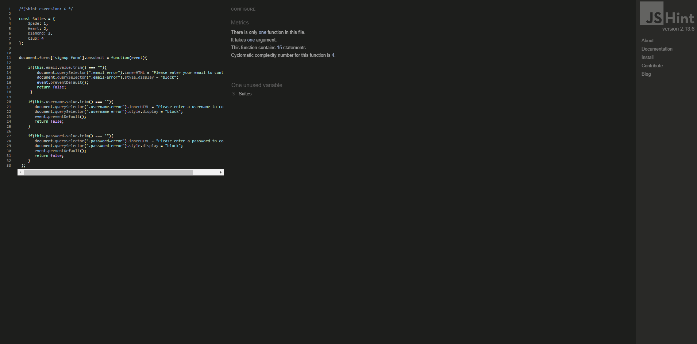
* I used the code "/*jshint esversion: 6 */

const Suites = {
    Spade: 1,
    Heart: 2,
    Diamond: 3,
    Club: 4
};" to get rid of the const and let errors that only esversion 6 would validate. After adding that code to my script, my javascript code produced no errors.

 

# Performance 
Google lighthouse was used to test the performance of the website 

Home Page

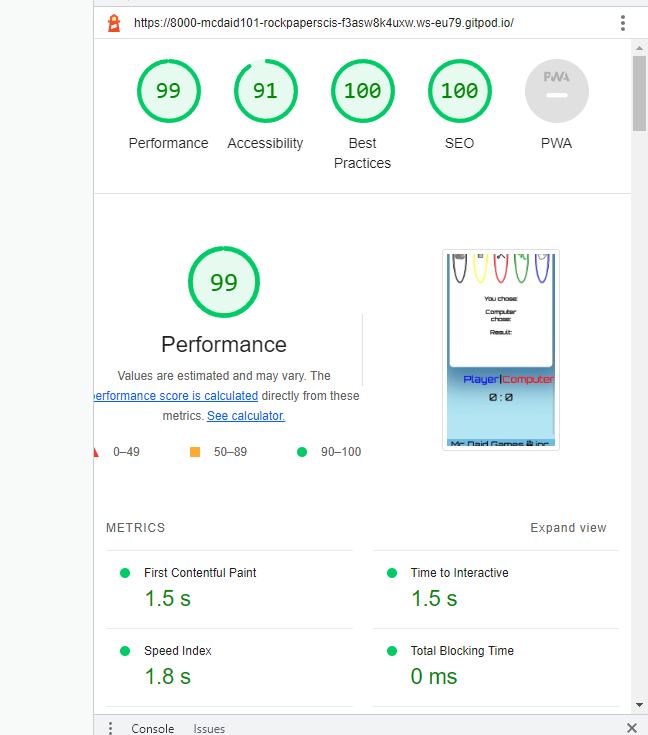

Sign up

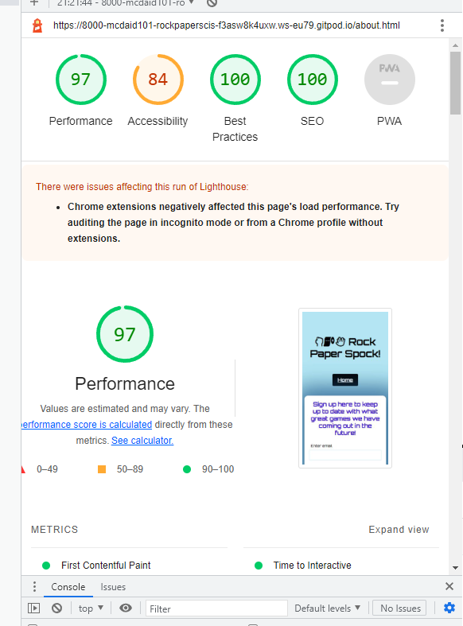

## Performance testing using different devices/browers
The website was tested on three devices:
* Apple Ipad Air 
* Apple Iphone XR 
* ASUS vivobook 
* Chrome developer tools were also used in the testing process with its many different device toggling options. 
The following browsers were used in compatability testing:
* Google Chrome 
* Microsoft Edge
Site fully functioning on each device and browser 

# Testing 

## Testing User Stories
  

## First time stories 
* As a first time user: I want to be able to easily navigate the site. 
Testing done to make sure that all links work so all users can easily navigate the page and eveyrthing is fully visible. 

First time user 1

| **Feature** | **Action** | **Expected Result** | **Actual Result** |
|-------------|------------|---------------------|-------------------|
|Links | Check links bring you to same page they are named after | Links when clicked bring you to page they are named after | Works as expected |

 
 

* As a first time user: I want to be able to play the game.   
 Testing done to ensure that the game is fully functional.

First time user 2

| **Feature** | **Action** | **Expected Result** | **Actual Result** |
|-------------|------------|---------------------|-------------------|
| Game | Click on buttons | You get the expected variable for which button you clicked and it appears in the "you chose:" area | Works as expected |

 
 

* As a first time user: I want to know what my score is in the game. 
 Testing done to ensure that the players score is incremented properly and displayed in the score area.

First time user 3

| **Feature** | **Action** | **Expected Result** | **Actual Result** |
|-------------|------------|---------------------|-------------------|
|Score area | Play the game and if it says you won that round your score will go up  | Your score will go up by 1 | Works as expected |

 
 

* As a first time user: I want to know what my opponent's (the computer's) score is.  
 Testing done to ensure that when the player loses a round the computers score goes up by 1.

First time user 4

| **Feature** | **Action** | **Expected Result** | **Actual Result** |
|-------------|------------|---------------------|-------------------|
|Score area |Play the game and if it says you lost that round the computer's score will go up  | The computer's score goes up by 1 | Works as expected |

 
 

* As a first time user: I want to be able to view the website clealry on my mobile phone.  
 Testing done to ensure that the entire website is fully responsive to any mobile device using chrome developer tools and physical Iphone and Ipad. 

First time user 5

| **Feature** | **Action** | **Expected Result** | **Actual Result** |
|-------------|------------|---------------------|-------------------|
|Entire website |Checked through chrome developer tools that the site is fully responsive across different screen sizes | The website is responsive over any screen size | Works as expected |

 
 

* As a first time user: I want to know the rules of the game.  
Testing done to ensure the modal pop up works and displays the rules of the game.

First time user 6

| **Feature** | **Action** | **Expected Result** | **Actual Result** |
|-------------|------------|---------------------|-------------------|
|How to play modal | Click the how to play modal button  | Rules of the game are displayed on screen | Works as expected |

 
 

* As a first time user: I want to know what button I chose. 
 Testing done to ensure that the results section displays the button you clicked.

First time user 7

| **Feature** | **Action** | **Expected Result** | **Actual Result** |
|-------------|------------|---------------------|-------------------|
| Results area | Click a variable button such as spock  | The screen will display you chose spock | Works as expected |

 
 

*  As a first time user: I want to know what the computer picked in response.  
 Testing done to ensure that once you click a button the computers choice will generate automatically after yours.

First time user 8

| **Feature** | **Action** | **Expected Result** | **Actual Result** |
|-------------|------------|---------------------|-------------------|
| Results area | Click a button, your choice will then display on screen | the computers choice will then appear afterwards beneath it | Works as expected |

 
 

* As a first time user: I want to know the result of that round.  
Testing done to ensure the result of the round is displayed on the screen.

First time user 9

| **Feature** | **Action** | **Expected Result** | **Actual Result** |
|-------------|------------|---------------------|-------------------|
| Playing the game | Play a round of the game to get the result  | Result of who won between player and computer will be outputted beneath their choices | Works as expected |

 
 

* As a first time user: I want to be able to easily navigate back to the home page.  
Testing done to ensure that the links to the home page work.

First time user 10

| **Feature** | **Action** | **Expected Result** | **Actual Result** |
|-------------|------------|---------------------|-------------------|
|Home button and logo links | Check link on the logo and home button work | Both links bring you to index.html | Works as expected |

 
 

## Returning stories

* As a returning user: I want to be able to sign up to know about future games produced by the creator.  
Testing done to ensure that the sign up form is fully functional.

Frequent user 2

| **Feature** | **Action** | **Expected Result** | **Actual Result** |
|-------------|------------|---------------------|-------------------|
|Sign up form | fill in the sign up form correctly and submit it | once submitted you will be directed to the code institute's form dump page  | Works as expected |

 
 

## Owner stories 
* As the site owner: I want users to know how to play the game.  
Testing done to ensure that the modal popup containing the game rules works.

Site owner 1

| **Feature** | **Action** | **Expected Result** | **Actual Result** |
|-------------|------------|---------------------|-------------------|
|Modal pop up | click on the how to play pop up  | The rules for the game are displayed on the screen | Works as expected |

 
 

* As the site owner: I want users to be able to sign up to our site to receive news on future games.   
Testing done to ensure that the sign up form is fully functional. 

Site owner 2

| **Feature** | **Action** | **Expected Result** | **Actual Result** |
|-------------|------------|---------------------|-------------------|
|Sign up form | fill in the sign up form correctly and submit it | once submitted you will be directed to the code institute's form dump page  | Works as expected |

 
 

* As the site owner: I want users to be able to easily navigate the site.   
Testing done to ensure users can easily navigate the site and all functions and links work.

Site owner 3

| **Feature** | **Action** | **Expected Result** | **Actual Result** |
|-------------|------------|---------------------|-------------------|
| Links and functions | Ensure all links and game is working | All links and features are working | Works as expected |

 

# Bugs 

| **Bug** | **Fix** |
| ----------- | ----------- |
| After submitting the form, you would be directed to a 405 page  | Used the code institute's form dump in the action element and set the method to post|
| Favicon file sometimes would not load on certain devices and would display an error in the dev tools console  | placed it in the root directory and seems to have solved the problem|

 

# Deployment 

## Creating this project
This project was created by navigating to the Code Institute's student template and clicking the 'use this template' button. I then inputted the repository name "
Rock-Paper-Scissors-Lizard-Spock" and included all branches. With the repository now created, I used the browser version of Vs Code to create the project. 
 

I used the following commands throughout this project:
* Git add . - This added my file to the staging area to be committed
* Git commit -m - This command committed any changes to the local repository along with a message
* Git push - pushed my changes to the github repository 
* git reset --hard HEAD^ - This removed my last commit 

## Github pages 
1. Navigate to the Rock-Paper-Scissors-Lizard-Spock repository 
2. Click on settings
3. Click on pages 
4. Select 'master branch' as source 
5. Then save 
6. Link is then generated to go to the live page 

## To run locally 
1. Navigate to the Rock-Paper-Scissors-Lizard-Spock repository 
2. Click the code drop down menu 
3. Click download as Zip
4. Open with IDE of choice 
5. Or 
6. open a terminal in an IDE and use git clone command followed by your git URL of the repository 
7. The project will then be created in your IDE

# Credits 

## Code 
* Javascript and css code for the form validator is inspired from a video on youtube from digitalfox tutorials you can find the link [here](https://www.youtube.com/watch?v=nNIr0lF7KnU)
* Code for the run game function is inspired form a video on youtube from Bro code you can find the link [here](https://www.youtube.com/watch?v=n1_vHArDBRA)
* Code for the open modal function and css is from free-code-camp, you can find a link to the article [here](https://www.freecodecamp.org/news/how-to-build-a-modal-with-javascript/)

## Media 
* The Spock.png file is taken from duckicon.com and is the website's favicon. 
* The images used in the buttons are all taken from Iconduck.com.
* Icons used in the site logo and McDaid games logo are from fontawesome.com
* All other images are my own.

## Acknowledgements 
* I would like to thank my mentor Ronan Mc Clelland for his help and guidance while I built this project.
* I would like to thank my family for their love and support.
* And finally my girlfriend for help testing my game on her mobile. 